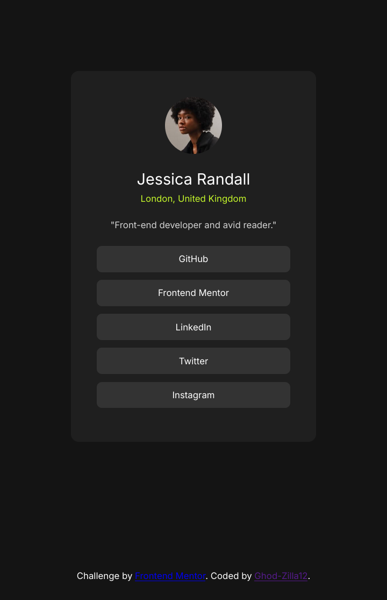

# Frontend Mentor - Social links profile solution

This is a solution to the [Social links profile challenge on Frontend Mentor](https://www.frontendmentor.io/challenges/social-links-profile-UG32l9m6dQ). Frontend Mentor challenges help you improve your coding skills by building realistic projects. 

## Table of contents

- [Overview](#overview)
  - [The challenge](#the-challenge)
  - [Screenshot](#screenshot)
  - [Links](#links)
- [My process](#my-process)
  - [Built with](#built-with)
  - [What I learned](#what-i-learned)
  - [Continued development](#continued-development)
- [AI Collaboration](#ai-collaboration)
- [Author](#author)
- [Acknowledgments](#acknowledgments)


## Overview

### The challenge

Users should be able to:

- See hover and focus states for all interactive elements on the page

### Screenshot



### Link

- Live Site URL: [https://ghod-zilla12.github.io/Profile-template/](https://ghod-zilla12.github.io/Profile-template/)

## My process

### Built with

- HTML5 - For the semantic structure of the profile. 
- CSS3 - Custom Properties and Flexbox.
- Google Fonts API.
- Spck Editor - The mobile Integrated Development Environment (IDE), used to write and test code on the go.
- Git/GitHub.
- GitHub pages.

### What I learned

For the html code, if my social link isn't inside a class link container, it'll just show a blue link without a clickable button, and that's what happened initially before I tackled that issue. 

The CSS code with the .social-link is what helped me have that we'll centered and nice bottons.

```html
<h1>Some HTML codes I learnt something from</h1>
<div class="links-container">
    <a href="https://github.com/Ghod-Zilla12" class="social-link">GitHub</a>
    <a href="https://www.frontendmentor.io/profile/Ghod-Zilla12" class="social-link">Frontend Mentor</a>
    <a href="www.linkedin.com/in/samuel-udo-dev" class="social-link">LinkedIn</a>
    <a href="#" class="social-link">Twitter</a>
    <a href="#" class="social-link">Instagram</a>
  </div>
```
```css
.social-link {
  display: block;
  width: 100%;
  text-align: center;
  box-sizing: border-box;
  padding: 12px;
  background-color: var(--grey-700);
  color: var(--white);
  text-decoration: none;
  font-weight: 600;
  border-radius: 8px;
  margin-bottom: 16px;
  transition: background-color;
}
```

### Continued development

Refining a card image and make it clickable is what I'm working toward in my future projects. 

### AI Collaboration 
- Tools used - Google Gemini, Claude, GitHub Copilot
- How I used them - debugging and brainstorming solutions

## Author

- Frontend Mentor - [Ghod-Zilla12](https://www.frontendmentor.io/profile/Ghod-Zilla12)
- Facebook - [Zilla](https://www.facebook.com/profile.php?id=61574520025702)
- LinkedIn - [Samuel udo](www.linkedin.com/in/samuel-udo-dev)

## Acknowledgments

I want to appreciate God for the strength and insight, I got inspirations from God and also books read.
